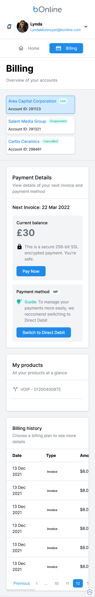
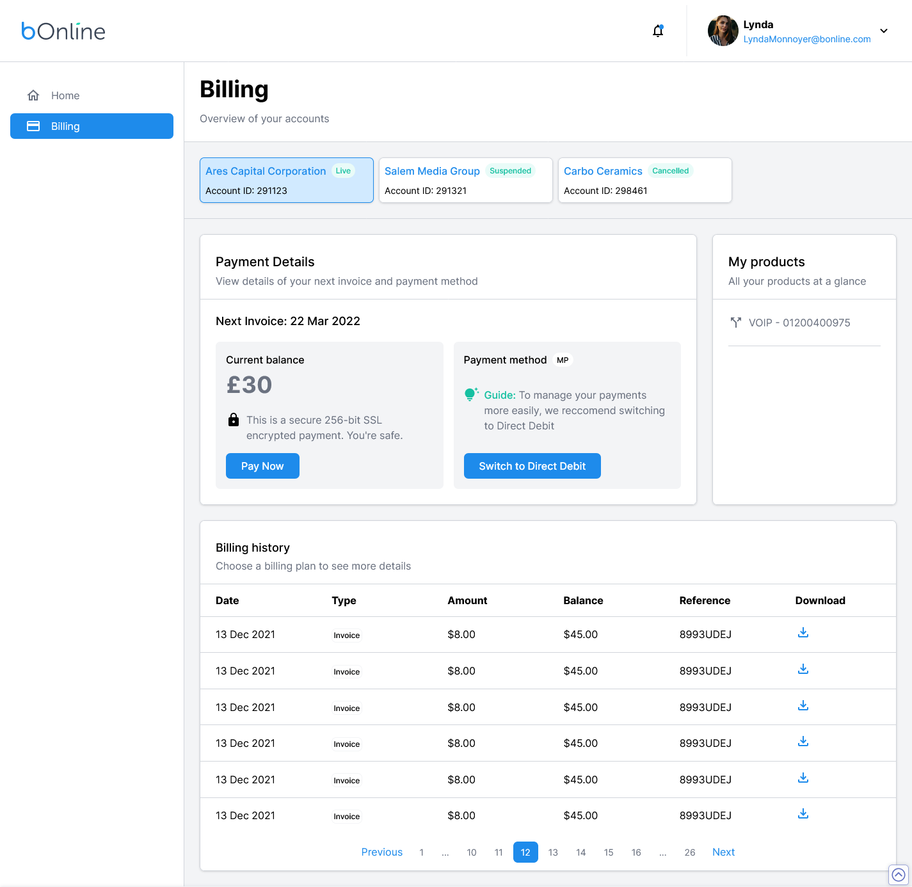

## Steps to install the project 📑

Step 1:

### `npm install`

Step 2:

### `npm install -g json-server`

Step 3:

### `npx json-server --watch data/db.json --port 8000`

Step 4:

### `npm start`

## Screenshot 📷

Mobile Design

Desktop Design

